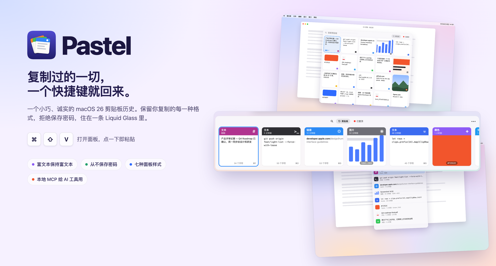
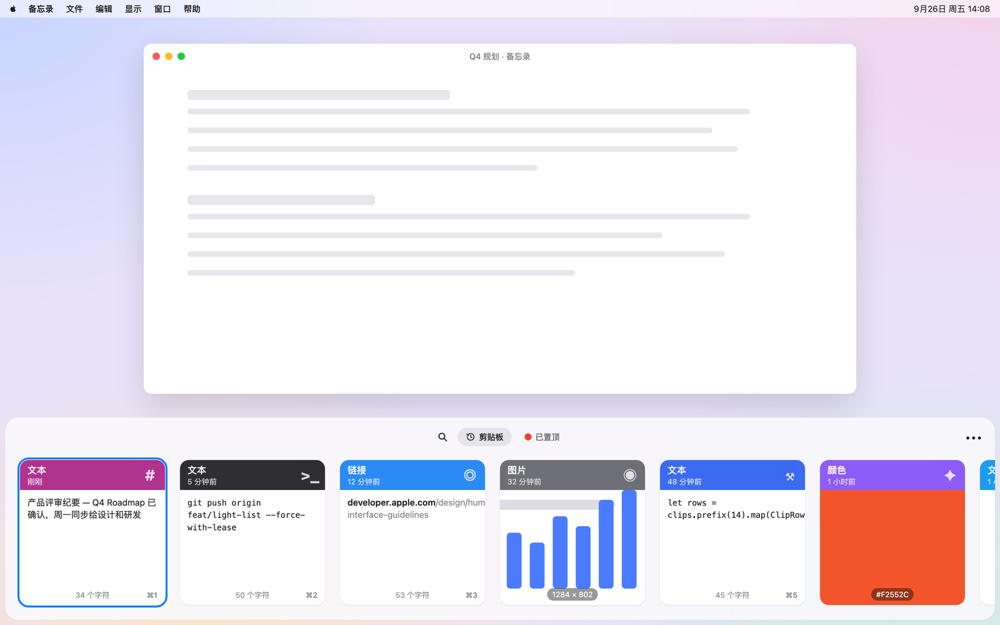
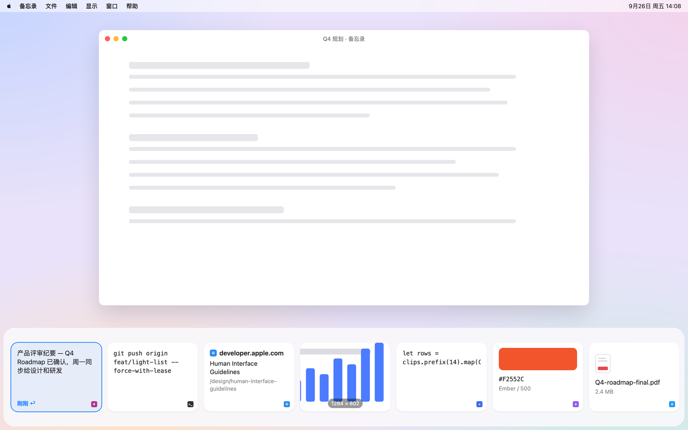
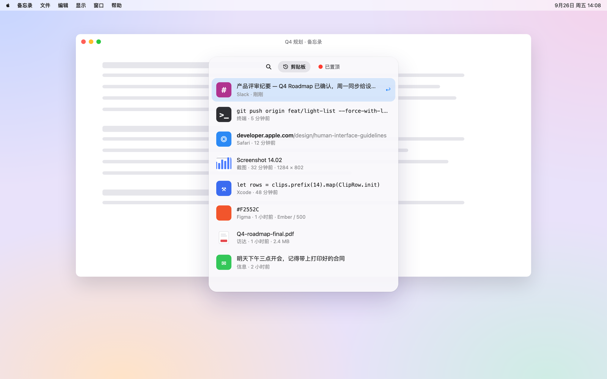
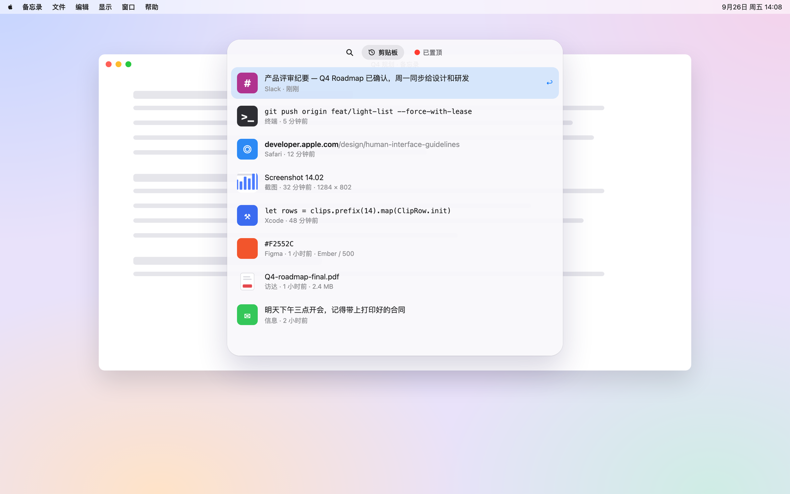
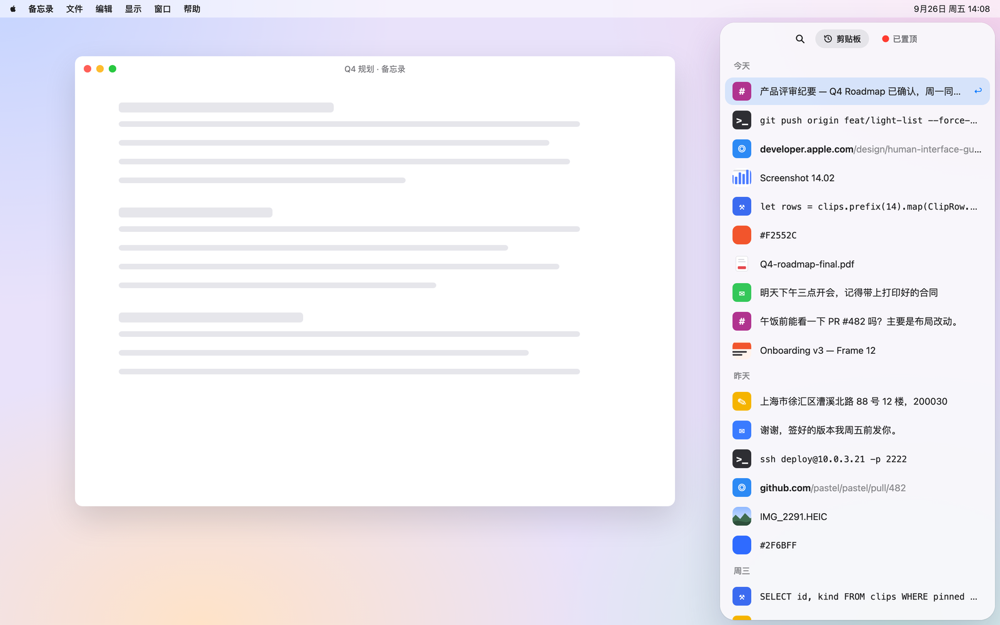
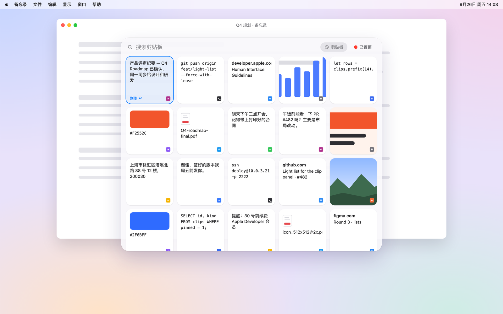
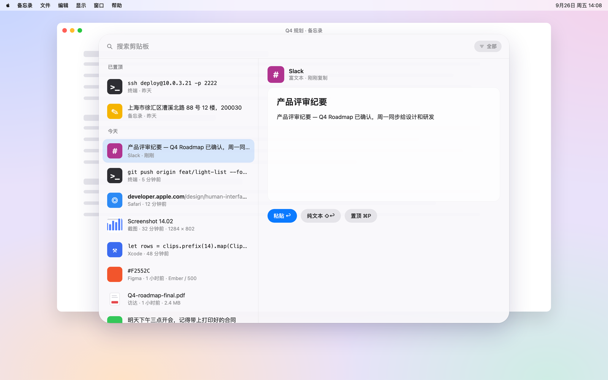

# Pastel

[English](README.md) · **简体中文**



一个 macOS 26 上的剪贴板历史管理器，用 Swift 6 和 SwiftUI 写成。

按下 <kbd>⌘</kbd><kbd>⇧</kbd><kbd>V</kbd>，屏幕底部滑出一条你复制过的内容，每条一张卡片，最新的在最左边。点一下卡片，就粘贴回你刚才工作的地方。

## 为什么又做一个

好用的剪贴板工具已经有不少了。这个存在的理由是：足够小、对自己存了什么足够坦白、从头到尾都读得懂——整个 App 大约 9,000 行 Swift，没有任何第三方依赖。如果你要的是功能齐全的商业产品，去买一个；如果你想看看现代 macOS 上剪贴板捕获到底是怎么做的，读 `ClipboardMonitor.swift`。

## 它能做什么

- 捕获一次复制的**所有剪贴板格式**，而不只是纯文本。粘贴时全部写回，所以富文本还是富文本，HTML 还是 HTML，不会被压扁。
- **拒绝保存密码等秘密。** 两层彼此独立的防护，默认开启，且都不能关闭——见[隐私](#隐私)。
- 粘贴到你刚才真正在用的那个 App；没有权限时退化为"已经放进剪贴板，按 ⌘V"。
- 搜索、方向键导航、<kbd>⌘</kbd><kbd>⌫</kbd> 删除，以及把卡片直接拖进别的 App。
- 在菜单栏暂停捕获，或者用 `open paster://pause`。
- <kbd>⌘</kbd><kbd>1</kbd>–<kbd>⌘</kbd><kbd>9</kbd> 直接粘贴前九张卡片，不用方向键移过去；加上 <kbd>⇧</kbd> 则粘贴为纯文本。
- **置顶**一条内容（<kbd>⌘</kbd><kbd>P</kbd>），它就不受条数上限*和*保留天数的限制，并在顶部单独成组。
- 在菜单栏或设置里一键**清空历史**。已置顶的内容会保留，系统剪贴板也会一并清空。
- 可自定义的快捷键，以及一个可选的[本地 MCP 接口](#mcp默认关闭)，让 AI 工具可以搜索历史。

## 七种面板样式

每种样式里都是同一份历史、同样的顺序、同样的按键——变的只是列表的形状和位置。在 设置 → 风格 里选择。

| | |
| --- | --- |
|  **基础风** — 沿屏幕底部排开的大卡片 |  **轻量底条** — 屏幕底部一条矮的小方块 |
|  **简约风** — 小浮动面板里的两行列表 |  **顶部下拉** — 像聚焦搜索一样从上方落下的列表 |
|  **右侧侧栏** — 屏幕右边缘满高的列表，按天分组 |  **小方格** — 屏幕中央的小方格 |
|  **命令面板** — 列表加上选中项的预览 | |

这些示意图由 [`design/readme/render.py`](design/readme/render.py) 用虚构的剪贴内容绘制，不是真实屏幕的截图。

## 它不做什么

不做同步。不对复制的截图做文字识别。一次复制只记一条，所以在访达里复制三个文件再粘贴，得到的是第一个。这些是有意的取舍，而不是疏漏——见[有意不做的功能](#有意不做的功能)。

## 系统要求

macOS 26.0 或更高版本，Apple 芯片。构建需要 Xcode 26。

## 安装

从 [Releases](../../releases) 下载 `paster.dmg`，打开后把 `paster.app` 拖进 `/Applications`。这个安装包**没有经过公证**（见下文），所以第一次打开会被 Gatekeeper 拦下；清除一次隔离标记即可：

```sh
xattr -dr com.apple.quarantine /Applications/paster.app
```

也可以自己构建：

```sh
git clone https://github.com/yinminqian/Pastel.git
cd Pastel
./scripts/release.sh
```

脚本会跑测试、构建 Release 版、检查签名状态，最后生成 `paster.dmg`。从 `/Applications` 启动而不是从 `DerivedData` 启动很重要，因为开机启动和辅助功能授权都绑定在一个稳定的位置和签名上。

### 关于公证

如果你有 Developer ID Application 证书，`scripts/release.sh` 会**自动**完成公证；没有的话会提示跳过。Apple Development 证书（也就是 Xcode 帮你装的那个）无法用于公证。没有公证的 DMG 在构建它的那台机器上可以正常运行，下载到其他机器上则会被 Gatekeeper 拒绝，直到像上面那样清除隔离标记。

### 权限

App 启动时什么权限都不要，缺了下面任何一项也能用——只是能做的少一些。

| 权限 | 有了它 | 没有它 |
| --- | --- | --- |
| **辅助功能** | 点卡片直接粘贴进你正在用的 App | 内容被放进剪贴板，由你按 <kbd>⌘</kbd><kbd>V</kbd> |
| **从其他 App 粘贴** | 读取剪贴板时不会每次都弹提示 | macOS 可能每次复制都弹窗询问，历史功能就没法用了 |

两项都在 系统设置 → 隐私与安全性 里授权。面板上会显示一条提示，带一个直接打开对应设置页的按钮。

这个 App **没有沙盒**，因为沙盒 App 无法获得控制其他应用的辅助功能权限，而粘贴恰恰需要它。这也意味着它不能上架 Mac App Store。

## 隐私

剪贴板历史是一台电脑上最敏感的数据之一，这里的默认设置都是有意为之。

**第一层——主动要求被忽略的 App。** [nspasteboard.org](http://nspasteboard.org) 约定允许 App 给自己写入剪贴板的内容打标记。凡是标记为 `ConcealedType`（密码管理器用的）、`TransientType`、`AutoGeneratedType`，或者约定出现之前的两个标记 `de.petermaurer.TransientPasteboardType` 与 `com.typeit4me.clipping` 的内容，一律不保存。

**第二层——不主动要求的 App。** 第一层只有在对方 App 配合时才有效，而很多密码管理器根本不打这些标记。所以只要复制时最前面的 App 是已知的密码管理器，内容就一律丢弃；匹配的是 bundle identifier 的片段，一条规则就能覆盖同一厂商的各个版本。如果完全无法判断最前面是哪个 App，这条内容也会被丢弃——来源不明的剪贴板写入，恰恰可能是有东西在后台写入秘密。

两层都不是开关。一个能关掉密码保护的开关，迟早会被误关。你可以在 设置 → 隐私 里*添加*自己要排除的 App，但不能移除内置的规则。

**其他选择：** 设置里可以让面板不出现在屏幕共享、录屏和截图中（`sharingType = .none`）；默认关闭，因为面板只在你主动呼出时才出现在屏幕上。通用剪贴板（Universal Clipboard）的内容*会*保存——在手机上复制的东西，正是你想在这里找到的——但会打上标签，因为它不是由 Mac 上最前面的 App 产生的。存储**没有静态加密**，和其他剪贴板工具一样依赖 FileVault。

## MCP（默认关闭）

App 可以通过 [Model Context Protocol](https://modelcontextprotocol.io) 把历史开放给 AI 工具。它**在你手动打开之前一直是关的**（设置 → MCP），重启后也保持关闭，因为它开放的是你最近复制过的每一个密码重置链接、地址和写了一半的消息。

打开后会生成一个访问令牌并启动一个 HTTP 服务。设置里有一个 **拷贝配置命令** 按钮，把结果粘贴到终端：

```
claude mcp add --transport http paster http://127.0.0.1:4257/mcp \
  --header "Authorization: Bearer <token>"
```

四个工具，命名沿用现有剪贴板 MCP 服务约定俗成的名字：

| 工具 | 作用 |
| --- | --- |
| `search_clipboard` | 查找预览中包含某段文字的内容 |
| `get_recent_items` | 列出最新的若干条 |
| `read_clipboard_item` | 按 id 读取一条的完整内容——预览截断在 500 个字符 |
| `copy_to_clipboard` | 把一条已存的内容或一段文字放进剪贴板 |

**它不会做的事。** 它从不代替模型往某个 App 里粘贴——`copy_to_clipboard` 放进剪贴板就停，因为模型并不知道最前面是哪个 App，也不知道有没有输入框处于焦点。它从不返回原始数据，所以图片内容返回的是元数据，而不是一兆字节的 base64。从未被保存的内容——隐私层丢弃的一切——根本无法访问，因为它们不存在。

**它是怎么被保护的，以及这种保护值多少。** 监听只绑定 `127.0.0.1`，局域网里访问不到；每个请求都要带令牌；带 `Origin` 请求头的请求直接拒绝，因为真正的 MCP 客户端从不发送它，而网页无法不发送——这就是 MCP 规范要求的 DNS 重绑定防护。`GET` 和 `DELETE` 被拒绝，分块传输的请求体被拒绝，超过 1 MB 的请求体被拒绝，每个连接只服务一个请求就关闭。

令牌存在 `UserDefaults` 里，这是一个值得直说的有意取舍：任何以你的身份运行的进程都能读到偏好设置文件。令牌防的是网页访问回环地址、以及这台机器上的其他用户——防不了已经以你的身份在运行的本地代码。放进钥匙串能提高这道门槛，但也会在启动服务的路径上加一个授权弹窗；对于一个默认关闭、只监听回环地址的功能来说，这不划算。

初始化握手和较新的无状态协议版本都支持：对先发 `initialize` 的客户端正常应答，对不发的客户端也直接应答 `tools/list`。

## 测试

```sh
xcodebuild test -project paster.xcodeproj -scheme paster -destination 'platform=macOS'
```

160 个测试，覆盖那些一旦出错代价大、又不会自己暴露的部分：两层隐私防护、数据归档的往返、内容类型判定的优先级、指纹的稳定性、图片重新编码的边界，以及数据回填的幂等性。scheme 是共享的，所以 CI 跑的是同一条命令。

写这些测试，是因为以前的行为是靠手写的 shell 探针检查的，而那些探针错过两次——一次报告了一个并不存在的快捷键冲突，一次把所有已存数据都报成损坏，其实是探针读错了 Core Data 的帧头字节。

## 架构

没有第三方依赖。核心文件：

| 文件 | 职责 |
| --- | --- |
| `ClipItem.swift` | SwiftData 模型、数据归档格式、schema |
| `ClipboardMonitor.swift` | 轮询剪贴板、执行策略、写入存储 |
| `ClipboardPrivacy.swift` | 排除名单，写成一个纯函数 |
| `PasteService.swift` | 把内容写回剪贴板并模拟 ⌘V |
| `PanelController.swift` | 浮动的 `NSPanel` 及其生命周期 |
| `HotKeyMonitor.swift` | 全局快捷键 |
| `PermissionsService.swift` | 辅助功能和剪贴板访问权限的状态 |
| `ClipboardPanelView.swift` | 面板的 SwiftUI 内容 |
| `SettingsView.swift` | 设置界面，包括隐私页 |
| `AppSettings.swift` | 用户偏好，存于 `UserDefaults` |
| `LaunchAtLogin.swift` | `SMAppService` 注册 |
| `pasterApp.swift` | App 入口、菜单栏图标、`paster://` 深链接 |

改动任何东西之前，有三件事值得知道：

**捕获只能靠轮询。** `NSPasteboard` 没有通知、没有代理、也没有 publisher——只有一个只读的 `changeCount`。轮询它不是偷懒，而是这个 API 唯一提供的机制。

**面板是 AppKit，不是 SwiftUI scene。** 一个浮在其他 App 之上、出现在每个桌面空间里的无边框窗口，用 scene API 表达不出来。`PanelController` 持有一个 `NSPanel`，通过 `NSHostingView` 承载 SwiftUI。

**全局快捷键用的是 Carbon。** `RegisterEventHotKey` 不需要任何权限，并且独占这个组合键。看起来更现代的 `NSEvent.addGlobalMonitorForEvents` 既需要辅助功能权限，*又*无法吞掉事件，于是最前面的 App 也会收到这次按键。

## 有意不做的功能

这些是故意不做的，写在这里免得有人再重新推导一遍原因：

- **同步。** 要么用 SwiftData 的 CloudKit 镜像——它禁止唯一约束，还强制所有属性都是可选的——要么手写一套 `CKSyncEngine`。对一份本地历史来说，都不值得。
- **一次复制多个项目。** 一次复制多个文件会合并成一条。要正确支持，需要一个新的 schema 版本和真正的迁移；现在的做法是坦白这个限制，而不是半吊子地支持它。
- **撤销。** 删除是永久的。删除键是 <kbd>⌘</kbd><kbd>⌫</kbd> 而不是 <kbd>⌫</kbd>，这样你在搜索框里打字时不会误删。
- **静态加密、单独的来源 App 表、独立的逻辑 id。** 第一项依赖 FileVault；后两项解决的是这个 App 目前还没有的问题。

## 许可证

MIT，见 [LICENSE](LICENSE)。
